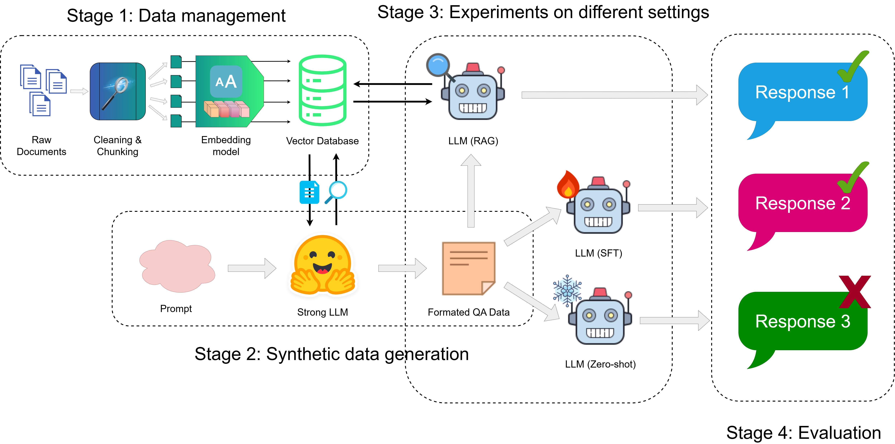

# 人工智能实践——大模型身份证问答

## 任务背景

在日常生活中，涉及居民身份证的业务（如首次申领、换领、补领、临时身份证办理、跨省通办等）是群众经常需要办理的事项。然而，由于相关政策法规、所需材料、办理流程和地点可能因地区和具体情况而异，群众在办理前往往会遇到各种疑问。

传统的咨询方式，如查阅官方网站的静态 FAQ、拨打政务服务热线或前往线下服务窗口，存在一些局限性。官方网站的信息可能分散、更新不及时或难以检索；咨询热线常遇占线或服务时间有限；线下窗口则面临人流量大、排队等待时间长以及工作人员需重复解答常见问题的压力。这些问题导致群众获取信息不够便捷高效，降低了服务体验，也占用了宝贵的政务服务资源。

为了提升政务服务效率、优化群众办事体验，并缓解基层工作人员的咨询压力，利用先进的人工智能技术构建一个智能化的身份证业务问答系统成为一个迫切需求。大语言模型（LLM）凭借其强大的自然语言理解和生成能力，能够在海量的身份证业务相关文本资料（如法规文件、办理指南、常见问题解答等）中学习、整合知识，并以自然、易懂的方式回答用户提出的各类复杂或具体的身份证业务问题。

因此，本项目旨在探索和实践如何利用大语言模型技术，构建一个高效、准确、便捷的身份证业务智能问答系统，使用户能够随时随地通过自然语言交互，快速获得权威、可靠的身份证业务咨询服务

## 任务设计

## 向量数据库构建

### 文档预处理

### RAG构建

### 生成数据集

## 方案1——RAG

### 原理解释

### 实验设置

## 方案2——SFT

### 原理解释

### 实验设置

## 效果评估

### 

## 参考资料

### Repositories

### Publications

[^1]: Lewis P, Perez E, Piktus A, et al. Retrieval-augmented generation for  knowledge-intensive nlp tasks[J]. Advances in neural information  processing systems, 2020, 33: 9459-9474.

